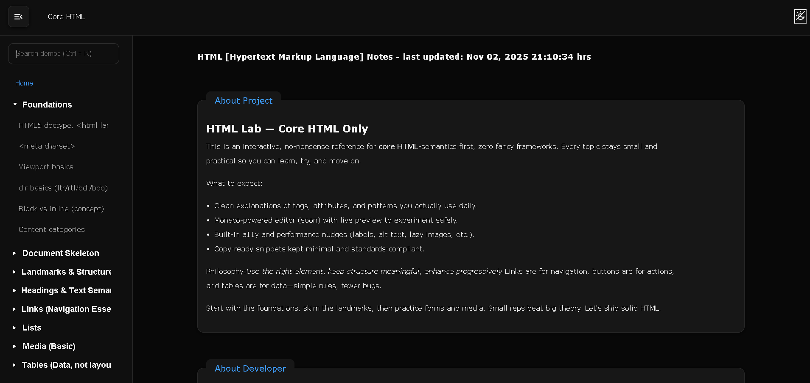

# Core HTML — Interactive Notes & Demos



Semantic, accessible, and production-friendly HTML patterns with runnable demos (Monaco), topic-wise navigation, and skip-to-content UX.

## Live

-   **GitHub Repo:** https://github.com/a2rp/core-html
-   **GitHub Pages:** https://a2rp.github.io/core-html/

## Clone

```bash
git clone https://github.com/a2rp/core-html.git
cd core-html
```

Quick Start

```bash
# install
npm i

# dev
npm run dev

# build & preview
npm run build
npm run preview
```
