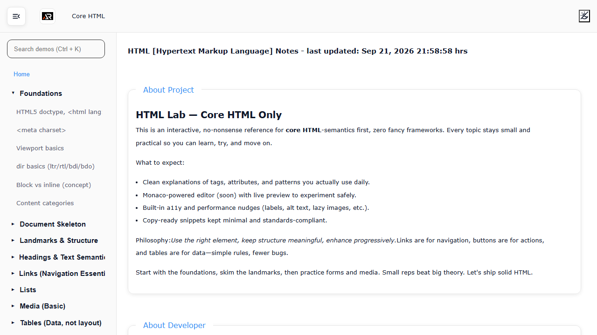

# Core HTML Interactive Notes

A React and Vite learning workspace for semantic HTML, accessibility patterns, metadata, forms, media, navigation, and practical browser demos.



## Features

- Topic-based navigation with expandable sections
- Searchable demo menu with keyboard shortcuts
- Runnable HTML examples and interactive playgrounds
- Accessible navigation, focus handling, and skip-link patterns
- Dark and light theme support
- Responsive fixed header and independent navigation scrolling

## Tech stack

- React
- Vite
- React Router
- styled-components
- Material UI and Monaco Editor
- React Icons

## Run locally

```bash
npm install
npm run dev
```

Build and deploy to GitHub Pages with:

```bash
npm run build
npm run deploy
```

## Links

- Portfolio: [https://www.ashishranjan.net/](https://www.ashishranjan.net/)
- GitHub: [https://github.com/a2rp](https://github.com/a2rp)
- CodePen: [https://codepen.io/ash1198](https://codepen.io/ash1198)
- LinkedIn: [https://www.linkedin.com/in/aashishranjan](https://www.linkedin.com/in/aashishranjan)
- Facebook: [https://www.facebook.com/theash.ashish/](https://www.facebook.com/theash.ashish/)
- YouTube: [https://www.youtube.com/@ashishranjan-ashz?sub_confirmation=1](https://www.youtube.com/@ashishranjan-ashz?sub_confirmation=1)
- Email: [ash.ranjan09@gmail.com](mailto:ash.ranjan09@gmail.com)

## Support

- Support: [https://a2rp-donation-page.netlify.app/](https://a2rp-donation-page.netlify.app/)
- Buy Me a Coffee: [https://buymeacoffee.com/a2rp](https://buymeacoffee.com/a2rp)
- Patreon: [https://www.patreon.com/a2rp](https://www.patreon.com/a2rp)
