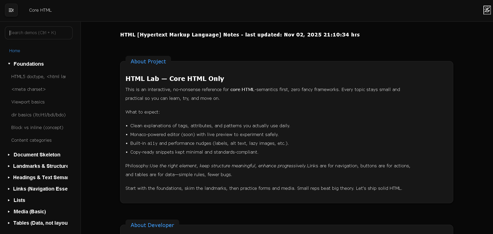

# Core HTML — Interactive Notes & Demos



Semantic, accessible, and production-friendly HTML patterns with runnable demos (Monaco), topic-wise navigation, and skip-to-content UX.

## Live

-   **GitHub Repo:** https://github.com/a2rp/core-html
-   **GitHub Pages:** https://a2rp.github.io/core-html/

## Clone

```bash
git clone https://github.com/a2rp/core-html.git
cd core-html
```

Quick Start

```bash
# install
npm i

# dev
npm run dev

# build & preview
npm run build
npm run preview
```

## Author

Ashish Ranjan, Full-Stack Web Developer

- Portfolio: [ashishranjan.net](https://www.ashishranjan.net/)
- GitHub: [a2rp](https://github.com/a2rp)
- CodePen: [ash1198](https://codepen.io/ash1198)
- LinkedIn: [aashishranjan](https://www.linkedin.com/in/aashishranjan)
- Facebook: [theash.ashish](https://www.facebook.com/theash.ashish/)
- YouTube: [Ashish Ranjan](https://www.youtube.com/@ashishranjan-ashz?sub_confirmation=1)
- Email: [ash.ranjan09@gmail.com](mailto:ash.ranjan09@gmail.com)

## Support

- [Support page](https://a2rp-donation-page.netlify.app/)
- [Buy Me a Coffee](https://buymeacoffee.com/a2rp)
- [Patreon](https://www.patreon.com/a2rp)

## Links

- Portfolio: [https://www.ashishranjan.net](https://www.ashishranjan.net)
- GitHub: [https://github.com/a2rp](https://github.com/a2rp)
- CodePen: [https://codepen.io/ash1198](https://codepen.io/ash1198)
- LinkedIn: [https://www.linkedin.com/in/aashishranjan](https://www.linkedin.com/in/aashishranjan)
- Facebook: [https://www.facebook.com/theash.ashish/](https://www.facebook.com/theash.ashish/)
- YouTube: [https://www.youtube.com/@ashishranjan-ashz?sub_confirmation=1](https://www.youtube.com/@ashishranjan-ashz?sub_confirmation=1)
- Email: [ash.ranjan09@gmail.com](mailto:ash.ranjan09@gmail.com)

## Support

- Support: [https://a2rp-donation-page.netlify.app/](https://a2rp-donation-page.netlify.app/)
- Buy Me A Coffee: [https://buymeacoffee.com/a2rp](https://buymeacoffee.com/a2rp)
- Patreon: [https://patreon.com/a2rp](https://patreon.com/a2rp)